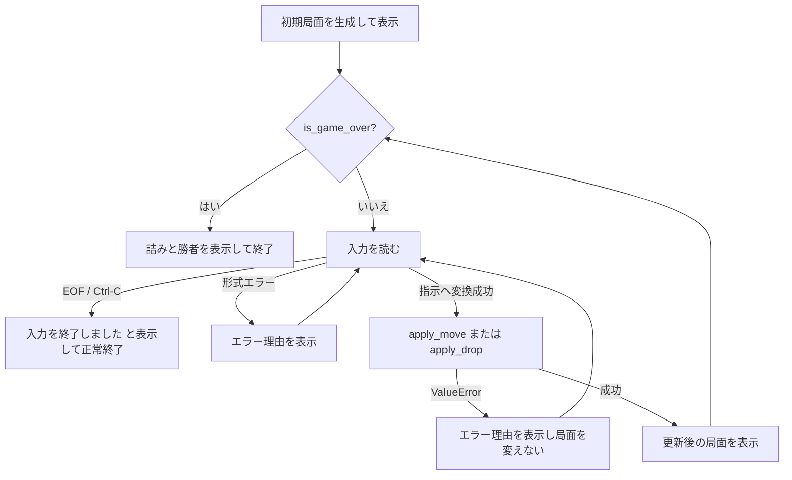

# CLIでの指し手入力と対局進行：設計仕様

作成日：2026-09-23

## 目的と範囲

平手の初期局面を表示した後、CLIから一手ずつ指し手を入力し、既存の合法手適用を
用いて局面を進める。合法手を適用したら更新後の局面を表示し、今回唯一実装済みの
終局である詰みなら入力を停止する。

将棋は先手から交互に一手ずつ指す。日本将棋連盟の対局規則では詰みまたは投了で
対局が終了し、二歩、行き所のない駒、打ち歩詰め、王手放置などの反則は反則者の
即負けである。本CLIでは、駒を動かす前に既存の合法手検証を行えるため、入力が
拒否されたときは公式戦の反則勝敗を再現せず、理由を表示して同じ手番で再入力する。
これは学習用の入力操作としての最小範囲である。

出典：[日本将棋連盟「対局規則」第2条・第6条・第10条](https://www.shogi.or.jp/match/taikyoku_rules/)

今回の終局は `is_game_over(position)` が真になる詰みだけである。投了コマンド、
反則勝敗、千日手、持将棋、入玉、時間、指し手履歴、USI/SFENは扱わない。

## 入力形式

入力は前後の空白を除き、次の二形式だけを受け付ける。区切りには半角スペースと
全角スペースのどちらも使える。筋・段には半角数字と全角数字のどちらも使える。
実装はPython標準の `str.split()` と `int()` を使うため、タブや改行など他のUnicode空白も
区切りとして受け付ける。この許容範囲は、端末入力を単純に分解する学習用CLIの仕様とする。

| 種類 | 形式 | 例 | 接続先 |
| --- | --- | --- | --- |
| 盤上移動 | `move <元の筋> <元の段> <先の筋> <先の段> [ + ]` | `move 7 7 7 6`、`move　２　２　２　１　+` | `apply_move` |
| 駒打ち | `drop <歩|香|桂|銀|金|角|飛> <筋> <段>` | `drop 歩 5 5`、`drop　歩　５　５` | `apply_drop` |

操作語 `move` / `drop` と成り記号 `+` は半角ASCIIだけを受け付ける。全角の操作語や
成り記号、未知の駒名、空行、引数不足・過多、数値にできない筋段は形式エラーとする。

`move` の末尾の `+` は成りを選択する印である。印がなければ不成を指定する。ただし、
行き所のない歩・香・桂の強制成りや、成れない場所での成り指定は既存の `apply_move`
が判定する。これはGUIでの「成る／成らない」の選択を一行入力に置き換えるものであり、
USIの成り記号とも似ているが、今回の筋・段表現はUSIではない。

## 構成と責務

`kaname_shogi/cli.py` を追加し、CLI固有の文字列処理と進行をモデル・合法手処理から
分離する。`kaname_shogi/__main__.py` はCLIを起動するだけにする。

- `parse_command(text)` は入力文字列を検証し、盤上移動または駒打ちを表す非公開の
  指示値へ変換する読み取り操作である。局面を受け取らず、変更もしない。形式エラーは
  利用者向けの `ValueError` とする。
- `run_game(input_fn=input, output_fn=print)` は新しい初期局面を作り、表示、入力、適用、
  再入力、詰みによる停止を行う操作である。既定値は端末の `input` と `print` だが、
  テストでは入力・出力を差し替えられる。
- `apply_move` と `apply_drop` は既存どおり、合法性の判定と局面変更だけを担当する。
  CLI側は合法性を重複判定しない。
- `render_position` は局面を文字列化する読み取り操作として維持し、成駒6種（と、成香、
  成桂、成銀、馬、竜）も表示できるようにする。成りを選択した後の局面を必ず表示する
  ため、この対応はCLI対局に必要な最小修正である。

入力を表す指示値は、移動なら元・先の `Square` と成り指定、駒打ちなら
`BasicPieceType` と先の `Square` を持つ。これはCLI内部だけで使い、将来の棋譜やUSIの
ための汎用 `Move` 型を先取りしない。

## 進行とエラー処理

初期局面が終局であることは通常ないが、進行操作の契約を一貫させるため、初期表示後も
終局確認を行う。合法手の成功後は、手番が既存操作で交代した局面を表示してから終局を
確認する。詰みなら手番側が詰まされた側なので、その反対側を勝者として表示する。

形式エラーと `apply_move` / `apply_drop` の `ValueError` は、いずれも `エラー：<理由>`
を表示し、局面を変えず同じ手番で再入力する。EOFと `KeyboardInterrupt`（Ctrl-C）は
勝敗・投了・反則として扱わず、`入力を終了しました。` を表示して正常に終了する。

## テスト方針

- 解析：半角・全角の空白と数字を含む二形式、成り記号、各日本語駒名を正しく読む。
  空行、未知の操作語・駒名、引数の過不足、全角操作語・成り記号を形式エラーにする。
- 進行：合法な盤上移動・駒打ちを既存操作へ渡し、局面表示と手番交代を確認する。
- 再入力：形式エラーと既存規則による拒否の後、同じ手番で次の合法手を受け付ける。
- 終局：詰み局面では入力せず勝者を表示して停止し、合法手で詰みになった後も入力を
  増やさない。EOFとCtrl-Cは終了メッセージを表示し、例外を外へ出さない。
- 表示：6種の成駒を含む局面を表示できることを確認する。
- 既存のCLI起動テストは、一度表示して終了する期待から、入力をEOFとして与えたときの
  出力と終了コードを確認する形へ更新する。

対象テスト、全テスト、`python3 -m kaname_shogi`（EOFを与える）、`git diff --check` を
実行する。テストメソッド名は英語、日本語docstringには振る舞いと検出したい誤りを書く。

## 実施しないこと

- USIの `7g7f`、`P*5e` 形式、USI通信、SFEN変換
- 投了、待った、履歴・棋譜、反則勝敗、千日手、持将棋、入玉、時間制御
- 候補手の表示、AIの応手、対人通信、GUI
- CLI用の仕様を理由に、モデルや既存の合法手APIへ入力文字列を混在させること

## 仕様の自己レビュー

- 入力形式、成り、全角空白・全角数字、形式エラーの範囲を明記した。
- 合法手適用・同一手番での再入力・詰み停止・EOF/Ctrl-Cを分離した。
- `cli.py`、既存の合法手操作、表示の責務を分離し、将来の汎用指し手型を先取りしない。
- 成駒表示が現行表示に不足しているため必要になる理由と、対象テストを明記した。
- 投了・反則勝敗・USIなどの対象外を明記し、未決定のプレースホルダを残していない。
