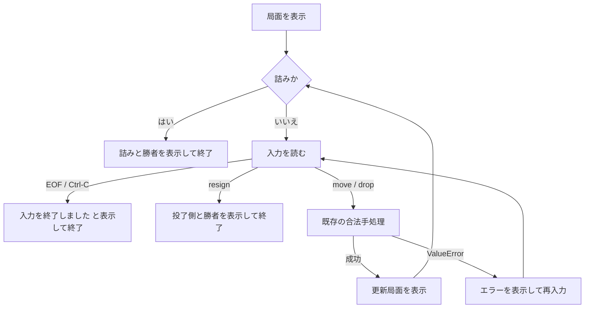

# 終局理由の拡張：設計仕様

作成日：2026-09-23

## 目的と範囲

第34回までのCLIは、局面から判定できる詰みだけで終局する。第35回では、日本将棋連盟の対局規則にある投了を、CLI入力による最小の終局理由として追加する。

日本将棋連盟の対局規則第6条第1項は、対局が詰みまたは相手の投了によって終了すると定める。また、第2条第4項は、相手の玉を詰ました対局者を勝者、玉を詰まされた対局者を敗者とする。投了は、対局者が敗北を認めて明示する終局である。

出典：[日本将棋連盟「対局規則」第2条・第6条](https://www.shogi.or.jp/match/taikyoku_rules/)、[日本将棋連盟「王手と詰み」](https://www.shogi.or.jp/knowledge/shogi/04.php)

今回扱うのは `resign` による投了だけである。千日手、持将棋、入玉、時間切れ、反則勝敗、待った、棋譜、USI/SFENは扱わない。

## 合意した入力と勝敗表示

投了は、半角ASCIIの `resign` だけを受け付ける。座標、駒名、成り記号は持たない。前後のUnicode空白は既存の `str.split()` により無視されるが、追加の単語、全角の操作語、異なる大文字小文字は入力形式エラーとする。

投了側は入力時点の `Position.side_to_move` で決める。表示は次の固定形式とする。

| 投了側 | 表示 |
| --- | --- |
| 先手 | `先手が投了しました。後手の勝ちです。` |
| 後手 | `後手が投了しました。先手の勝ちです。` |

投了は局面・手番・持ち駒を変更しない。勝敗を示したら局面を再表示せず、次の入力も読まずに `run_game` を終了する。

## 詰み・EOF・Ctrl-Cとの優先順位

各入力を求める前に、既存の `is_game_over(position)` を実行する。これは引き続き局面から分かる詰みだけを返す。詰みなら、投了を入力できる状態にせず、従来の詰みメッセージを表示して終了する。

投了は局面そのものの性質ではなく、入力中の手番側が行う意思表示である。そのため `movegen.py` の `is_game_over`、`is_checkmate`、`Position` は変更しない。`cli.py` が `resign` を解析し、対局進行として終局させる。

EOF（Ctrl-D）と `KeyboardInterrupt`（Ctrl-C）は明示的な投了ではない。どちらも従来どおり勝敗を付けず、`入力を終了しました。` を表示して正常終了する。

## 構成と責務

- `_ResignCommand` は投了を表す、凍結したCLI内部データである。局面操作ではない。
- `parse_command(text)` は既存の移動・駒打ちに加え、`resign` を `_ResignCommand` に変換する。局面や勝敗を変更しない。
- `_resignation_message(side_to_move)` は投了側と勝者を含む表示文字列を作る読み取り操作である。
- `run_game` は詰みの事前確認後に入力を読み、投了指示なら勝敗を表示して終了する。移動・駒打ちは既存の `_apply_command` と `apply_move` / `apply_drop` に委譲する。

将来の終局理由を理由に、汎用の終局結果型、履歴、局面への投了フラグを作らない。投了は局面から導けず、今回の最小要件はCLI入力の終了を正しく表示することだからである。

## テストと検証

- `parse_command("resign")` が投了指示を返すこと、`resign now` と全角操作語が形式エラーになることを確認する。
- 先手・後手それぞれの投了で、正しい投了側・勝者のメッセージ、局面不変、入力を一度だけ読むことを確認する。
- 既存の詰み局面は入力を読まず詰みとして終了することを維持する。
- EOF/Ctrl-Cが投了メッセージや勝者を出さず、従来の終了メッセージを出すことを維持する。
- 対象テスト、全テスト、標準入力へ `resign` を渡す実CLI、`git diff --check` を実行する。

## 仕様の自己レビュー

- 入力形式、投了側、勝者、局面不変、終了時の表示を明記した。
- 詰み、EOF、Ctrl-Cとの優先順位と差を明記した。
- 投了を局面判定に混在させず、CLI入力イベントとして限定した。
- 今回扱わない終局理由と将来の抽象化を先取りしないことを明記した。
