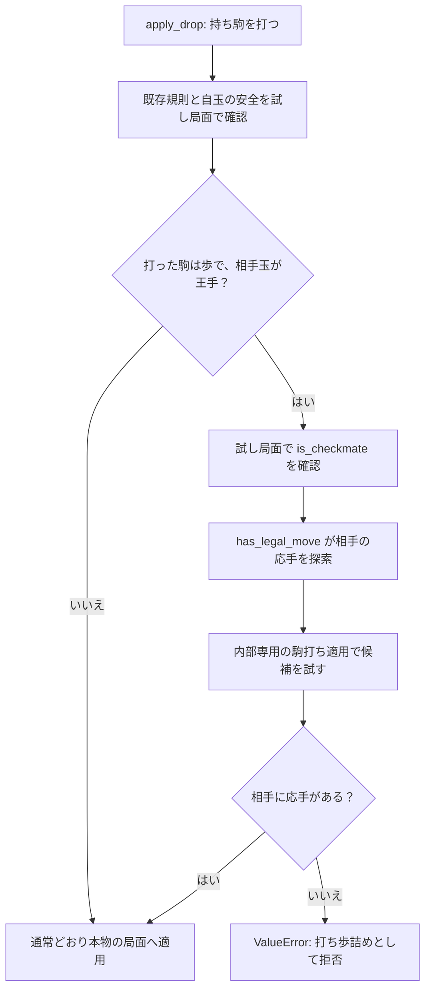

# 打ち歩詰め：設計仕様

作成日：2026-09-23

## 目的と範囲

持ち駒の歩を打った直後に、相手玉へ解除不能な王手をかける「打ち歩詰め」を
反則として拒否する。日本将棋連盟の対局規則は、打ち歩詰めを「持ち駒の歩を打って
解除不能な王手をかける行為」と定め、反則を犯した対局者は即負けとする。

出典：[日本将棋連盟「対局規則」第10条第1項三](https://www.shogi.or.jp/match/taikyoku_rules/)

今回の対象は、公開操作 `apply_drop(position, piece_type, destination)` による
持ち歩の打ちだけである。盤上の歩の移動による詰み、金・銀・飛車・角など歩以外の
駒打ちによる詰みは拒否しない。投了、千日手、持将棋、入玉、反則勝敗の結果表現、
CLI入力、指し手履歴は扱わない。

## 公開操作と責務

公開APIの引数・戻り値は増やさない。

- `apply_drop` は既存の玉、持ち駒、占有、二歩、行き所のない駒、自玉の安全を確認
  する。さらに、持ち歩の試し打ち後に相手側が詰みなら `ValueError` で拒否する。
  拒否時は盤面、双方の持ち駒、手番を変更しない。
- `has_legal_move` は、手番側に現在の実装範囲で合法手が一つでもあるかを返す。
  駒打ちの候補は `apply_drop` と同じ打ち歩詰め規則を受けるため、打ち歩詰めになる
  歩打ちは合法手に数えない。
- `is_checkmate` は、手番側の玉が盤上にあり王手を受け、`has_legal_move` が偽の
  ときだけ真を返す。打ち歩詰めの確認では、歩を打った後の相手番についてこの判定を
  用いる。

## 適用と詰み判定の関係

通常の持ち歩打ちでは、既存の自玉安全確認を通過した試し局面を使い、打った側と反対の
手番で詰みを調べる。相手玉がない、相手玉が王手を受けていない、または相手に一つでも
王手を解除する手がある場合は打ち歩詰めではなく、通常どおり適用する。

Mermaid はGitHub Markdownで図として描画される形式である。対応しない表示環境では、
コードブロック内のノード名と矢印をそのまま読める。

## 循環を避ける内部経路

公開操作同士をそのまま呼び合わせない。`movegen.py` に、外部から使わない非公開の
判定・適用経路を設ける。

1. 公開 `apply_drop` は、打ち歩詰め確認を有効にした非公開の駒打ち適用へ委譲する。
2. その非公開操作は、持ち歩の試し局面について、打ち歩詰め確認を**無効にした**
   非公開の詰み判定を呼ぶ。
3. 非公開の詰み判定は、同じく無効設定の非公開合法手探索を呼ぶ。
4. 非公開合法手探索が駒打ち候補を試すときは、打ち歩詰め確認を再開しない内部適用を
   使う。

この「有効か無効か」は非公開操作だけの内部引数または同等の非公開経路で表し、公開
`apply_drop`、`has_legal_move`、`is_checkmate` の使い方を増やさない。応手探索中も、
所有者、候補、成り、持ち駒、二歩、行き所のない駒、自玉の安全という既存規則は全て
検証する。無効にするのは、同じ打ち歩詰め確認をさらに開始する一段だけである。

この最小範囲では、打ち歩詰めかを調べるための相手応手探索を「既存規則で王手を解除
できる手」の探索として扱う。応手候補のさらに先で起こる打ち歩詰めは今回の探索対象に
含めず、再帰的な完全合法手体系や反則勝敗の表現は将来のテーマへ分離する。

## 玉なし部分局面

既存の `is_checkmate` と同じく、手番側の玉がない部分局面は `False` とする。したがって、
相手玉のないテスト用部分局面で持ち歩を打っても、打ち歩詰めとしては拒否しない。
これは不完全な盤面を候補生成のテストに使える既存契約を維持するためであり、通常の
対局局面に玉が一枚ずつあることを検証するものではない。

## テスト方針

- 先手・後手それぞれで、持ち歩を打った結果が相手玉への王手かつ詰みなら、
  `apply_drop` が `ValueError` を出し、局面を変えないことを確認する。
- 歩を打っても王手でない場合、玉が安全に逃げられる場合、玉が打った歩を安全に
  取れる場合は、打ち歩詰めとして拒否しないことを確認する。
- 盤上の歩の移動と、歩以外の駒打ちによる詰みは、今回の拒否対象でないことを確認する。
- `has_legal_move` が打ち歩詰めとなる歩打ちを合法手へ数えず、`is_checkmate` が
  その結果を用いることを確認する。
- 玉なし部分局面の持ち歩打ちを、打ち歩詰めとして拒否しないことを確認する。
- 対象テスト、全テスト、CLI起動、`git diff --check` を実行する。

## 実施しないこと

完全な反則勝敗の表現、打ち歩詰め以外の反則、合法手一覧や `Move` のような指し手の値、
反則をまたぐ再帰的な完全合法手体系、CLI入力、履歴、評価、探索、USI/SFENは扱わない。

## 仕様の自己レビュー

- 対象を持ち歩の打ちだけに限定し、盤上の歩移動と歩以外の駒打ちを対象外と明記した。
- `apply_drop`、`has_legal_move`、`is_checkmate` の関係と副作用を明記した。
- Mermaid図で通常適用・応手探索・拒否の分岐を示した。
- 非公開経路で打ち歩詰め確認を一段だけ無効化し、循環を断つ方法を明記した。
- 玉なし部分局面、検証範囲、対象外を明記し、未決定事項やプレースホルダを残していない。
