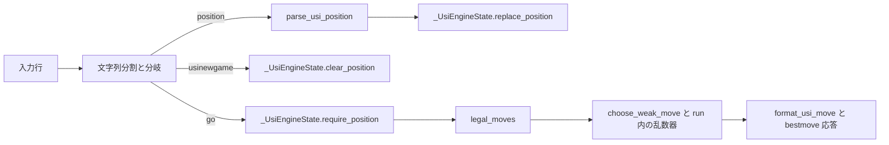

# 第58回「USIコマンド型・独立状態APIの導入要否を再検討する」設計仕様

## 状態

2026-10-04、本人はチャット上の設計案、本書、[実装計画](2026-10-04-usi-command-state-api-review-implementation-plan.md)を承認した。実装・独立レビュー2回・専用17テスト・全体281テスト・最終理解確認まで完了した。変更は同日に `main` へfast-forwardで取り込まれ、ShogiHome実対局は未実施。

## 目的

第57回で `run_usi_engine` 内に置いた最新 `Position` の管理と、USIコマンド行の分岐方法について、必要性を個別に再検討する。

第54回の使い捨てプローブが観測した一例、USI資料に説明されたコマンド、第57回のローカル実装、ShogiHomeで未確認の挙動を混同せず、未確認のコマンドを新たな実装要件として推測しない。

## 根拠を区別する

### USI一次資料

[The Universal Shogi Interface](https://hgm.nubati.net/usi.html) は、USI原案に将棋所GUIの拡張を加えた説明である。同資料のGUIからエンジンへのコマンドには、`usi`、`debug`、`isready`、`setoption`、`register`、`usinewgame`、`position`、`go`、`stop`、`ponderhit`、`gameover`、`quit` が記載されている。`go` は一つのコマンドであり、`searchmoves`、`ponder`、時計情報、`depth`、`nodes`、`mate`、`movetime`、`infinite` などは同じ行に付く引数として説明されている。エンジンからGUIへの `id`、`option`、`usiok`、`readyok`、`bestmove` などは逆方向の応答である。

この資料のコマンド一覧は、ShogiHomeがすべてを送ることや、本プロジェクトがすべてを実装する必要があることを示さない。

### 第54回のShogiHome実機一例

[第54回学習記録](../learning/54-usi-shogihome-connection-scope.md)には、Mac版ShogiHome 1.28.1と使い捨てプローブ間の一回の平手対局で観測した次の通信が記録されている。

`>` はShogiHomeからエンジンへの送信、`<` はエンジンからShogiHomeへの応答を表す。

```text
> usi
> setoption name USI_Hash value 32
> setoption name USI_Ponder value true
> isready
> usinewgame
> position startpos moves 7g7f
> go btime 591199 wtime 600000 byoyomi 30000
< bestmove resign
> gameover lose
> quit
```

これは単一プローブ・単一対局の観測である。合法な `bestmove` を返した場合、複数手の通常対局、SFEN、停止・先読み系コマンドをShogiHomeがどう扱うかの証拠ではない。

### 第57回のローカル実装

現在の `kaname_shogi/usi_engine.py` は、入力行を `split()` し、コマンド名を `if` / `elif` で分岐する。`usi`、`isready`、`usinewgame`、`position`、`go`、`quit` を処理し、`setoption` と `gameover` は読み飛ばす。未知コマンドは応答せず読み飛ばす。`go` の時計引数は使わず、認識済みの未対応検索引数は `ValueError` とし、未知の `go` トークンは読み飛ばす。

`position` は `position startpos moves <1手以上>` のみに対応し、`parse_usi_position` が一時的な `GameRecord` で手順を合法適用して最新 `Position` を返す。`run_usi_engine` はその `Position` と乱数生成器を関数内で保持する。`usinewgame` で局面を未設定へ戻し、同じ乱数生成器は一回の実行中に再利用する。`go` は `legal_moves`、`choose_weak_move`、`format_usi_move` に委譲し、選択した手を保持局面へ適用しない。

### ShogiHomeで未確認の挙動

`kaname-shogi` をShogiHomeへ登録した実対局、合法な `bestmove` に対するGUIの応答、複数手の通常対局、および停止・先読み・SFENを含むコマンドの送受信は未確認である。これらは[ロードマップ第5項](../roadmap-usi-shogihome.md)の実対局で扱う。第58回では未確認挙動を設計上の実装要件にしない。

## 設計判断

### コマンド行の表現

コマンド行を表す型は導入しない。`run_usi_engine` が文字列を分割し、現在の文字列分岐を維持する。資料に記載された全コマンドや、未確認のShogiHomeコマンドを型で先に表現しない。

### 状態オブジェクト

`kaname_shogi/usi_engine.py` に、モジュール内だけで使う非公開の `_UsiEngineState` を設ける。保持するのは最新の `Position` または未設定を示す `None` だけとする。状態オブジェクトは乱数生成器、USI行、指し手履歴、合法手選択器を保持しない。

状態オブジェクトの操作は次の三つとする。

| 操作 | 契約 |
| --- | --- |
| `replace_position(position: Position) -> None` | 呼び出し側で解析した最新局面を保持する。 |
| `clear_position() -> None` | 保持局面を未設定に戻す。乱数生成器には触れない。 |
| `require_position() -> Position` | 保持局面を返す。未設定なら `ValueError` を送出する。 |

`_UsiEngineState` は `usi_engine.py` 内に置き、package rootや他モジュールから再exportしない。クラスは局面状態のライフサイクルを表すデータ兼操作であり、USI文法解析、将棋規則、手の選択、標準入出力の責務を持たない。

### 乱数生成器と一手選択

乱数生成器は `run_usi_engine` の実行中に一つ用意し、現在の `choose_weak_move(moves, rng)` へ渡す。`usinewgame` の後も同じ乱数生成器を使う。これにより、USI局面を保持する状態オブジェクトを特定の手選択方式から独立させる。

`MoveChooser` などの選択器抽象、強い内部探索、外部エンジン接続はこの設計に含めない。別の選択方法が具体的な要件になった時点で、局面状態とは別にその境界を設計する。

### コマンドと状態の流れ



`position` の解析は状態への置き換えより先に完了する。既存の解析エラーは現在と同様に `ValueError` として呼び出し元へ伝わる。`go` 前に局面がない場合も `ValueError` を維持し、実行入口が標準エラーへ診断して非0終了する既存経路を保つ。未知コマンド、未対応 `go` 引数、固定応答、EOF、`quit`、出力のflushと標準出力の契約も変更しない。

`parse_usi_position` が返す `Position` を追加複製せず保持する。これは現行 `run_usi_engine` の保持方法を維持するためであり、新たな共有所有者を設けるものではない。

## 対象範囲

### 実装計画で扱う変更候補

- `kaname_shogi/usi_engine.py`：非公開 `_UsiEngineState` と三つの操作を追加し、`run_usi_engine` から利用する。
- `tests/test_usi_engine.py`：状態の置換・消去・未設定時の拒否、およびコマンドループとの接続を検証する。
- 現在の局面消去・未設定時の `go`・乱数器再利用・合法な `bestmove`・標準入出力に関する既存テストを維持する。

TDD、Red/Green確認、Refactor判断、独立レビュー、全体検証、学習・知識記録の更新は、実装計画を別に作成して承認を得た後に行う。

### 対象外

- USIコマンド型、全コマンドの列挙型、USIコマンドパーサーの新設。
- 公開の状態API、独立した状態モジュール、`GameRecord` をUSI実行中に保持すること。
- 乱数生成器を状態オブジェクトへ格納すること。
- 選択器の共通抽象、強い内部エンジン、外部エンジン接続。
- 時計管理、SFEN、`stop`、ponder、未対応 `go` 引数の新規対応。
- CLIとその起動入口の変更。
- ShogiHomeでの実対局。これはロードマップ第5項で扱う。

## 検証の考え方

実装計画では、非公開状態オブジェクトの各操作について未設定・置換・消去の境界を確認し、`run_usi_engine` の既存テストでUSIコマンドから状態更新・取得までの接続を確認する。特に次の既存振る舞いを維持する。

- `position` 後の `go` がその局面の合法手を返す。
- `usinewgame` 後、次の `position` より前の `go` は失敗し、前局面を再利用しない。
- 局面未設定の `go` は `ValueError` になる。
- `usinewgame` を挟む複数の `go` でも、実行中の乱数生成器は一つのままである。
- プロセス入口のflush、stdout/stderr分離、終了コードは変わらない。

ShogiHome実機テストは行わず、ローカルの自動テストをGUI互換性の証拠として扱わない。

## 以降の承認ゲート

本人は設計案、本書、実装計画を明示的に承認した。実装・検証・記録後に本人の承認を得て `main` へ取り込み、取り込み先テストと最終理解確認まで完了した。
