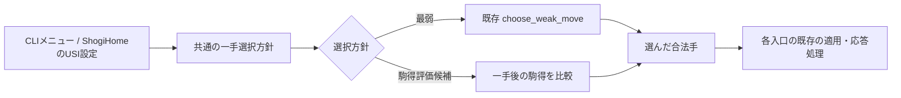

# 第63回「最弱モードを残す難易度選択」設計仕様

## 状態

2026-10-05、本人はチャット上で設計範囲と本書を承認した。本書は文書レビュー済み・承認済みである。この設計承認だけでは実装・テスト変更や実機操作を承認したことにならず、設計時点では実装計画も作成しない。

## 目的

現行の一様ランダム選択を最弱の選択肢として残し、CLIとShogiHomeの両方から、一局ごとに一手選択方針を選べるようにする設計を定める。駒得評価は追加候補として扱い、現行方式を置き換えない。

本テーマは設計のみである。製品コード、テスト、ShogiHome設定、対局、ログ採取は対象外とする。実装は別テーマで範囲・表現・確認方法を合意してから扱う。

## 根拠と現行状態

### 現行コード

- `kaname_shogi/movegen.py` の `choose_weak_move(moves, rng)` は、合法手があれば注入された乱数生成器で一様に選び、空なら `None` を返す。局面や手のデータを変更しない。
- `kaname_shogi/cli.py` の `GameMode` と `choose_game_mode` は人間・コンピュータの担当形式を表す。強さ・難易度を選ぶものではない。`_run_computer_turn` は `choose_weak_move` を直接呼ぶ。
- `kaname_shogi/__main__.py` は対局形式を対話形式で選び、その後 `run_game` を呼ぶ。
- `kaname_shogi/usi_engine.py` は `go` に対して合法手を列挙し、`choose_weak_move` で選ぶ。`usi` の応答で変更可能なオプションを通知せず、受信した `setoption` は読み飛ばす。
- 現行のUSIエンジン応答の契約は[確定知識](../knowledge/usi-engine-response.md)に記録されている。

### 外部仕様とShogiHome

[USI仕様](https://hgm.nubati.net/usi.html)では、エンジンは `usi` への応答で変更可能な `option` を通知し、GUIからの `setoption` で設定値を受け取る。`combo` はあらかじめ決めた値から選ぶオプション型である。

[ShogiHomeのエンジン登録手順](https://github.com/sunfish-shogi/shogihome/wiki/%E3%82%A8%E3%83%B3%E3%82%B8%E3%83%B3%E7%99%BB%E9%8C%B2%E6%89%8B%E9%A0%86)には、登録済みエンジンの設定画面と、設定の異なるエンジンを複製する操作が説明されている。本設計ではこの設定画面を利用面とする。ShogiHomeでの実設定・動作確認はしていない。

## 設計判断

### 選択肢と呼び方

利用者向けの選択肢は次の二つとする。

| 表示案 | 方針 | 性質 |
| --- | --- | --- |
| 最弱（一様ランダム） | `choose_weak_move` と同じ一様ランダム | 現行方式を維持する既定値 |
| 駒得を考える | 駒得評価の追加候補 | 一手後の駒得を比較し、探索はしない |

「駒得を考える」が常に強い、または一定の強さになる保証はしない。数値の段位・級位や強さの目標値も設定しない。

### 共通の一手選択境界

CLIとUSIは、共通の一手選択方針を表す値を同じ選択処理へ渡す。これにより表示・入力方法が異なっても、同じ方針値は同じ選択動作を意味する。

内部では方針を表す値（例：`MoveSelectionPolicy`、「一手選択方針」のデータ）を用い、共通の選択操作（例：`choose_move`、「一手を選ぶ」操作）で分岐する。汎用プラグイン、選択器クラス階層、将来の複数段階を先取りした登録機構は設けない。

- 最弱方針は既存 `choose_weak_move(moves, rng)` へ委譲し、現行の一様ランダムをそのまま残す。
- 駒得評価候補は各合法手を複製局面へ一手だけ適用し、一手後の駒得点を比べて最高点の手を選ぶ。相手の応手を調べる探索は含めず、最高点が同じ手の間は注入された乱数生成器で選ぶ。
- 選択処理は現在局面や合法手データを変更しない。合法手が空の場合は `None` を返し、終局表現は選択側へ持ち込まない。

駒価値表、成駒・盤上・持ち駒の細かな採点方法は本設計の範囲外とする。駒得評価を実装する別テーマで、対象と確認方法を改めて合意する。

### CLIでの選択

`choose_game_mode` で対局形式を選んだ後、コンピュータが参加する形式に限り難易度メニューを表示する。人間対人間では難易度を尋ねない。

- 空入力または未指定は最弱（一様ランダム）を選ぶ。
- 認識できない入力はエラーを表示し、選び直す。
- 選んだ方針は一局中固定する。対局中の切替コマンドは設けない。
- 対話メニューを経由しない `run_game` の呼び出しも、方針の既定値は最弱とする。

### ShogiHomeでの選択

USI `usi` 応答で、難易度用の `combo` オプションを `usiok` より前に通知する。既定値は最弱（一様ランダム）とし、選択肢に駒得評価候補を加える。ShogiHomeはエンジン設定画面でこの値を選び、USI `setoption` でエンジンへ渡す。

- 設定値が届かない場合は最弱を使う。
- 既知の難易度オプションに不正な値が届いた場合は、直前の有効値（未設定なら最弱）を保つ。
- 未知の `setoption` 名は現在どおり読み飛ばす。
- 方針の設定値は局面を保持する `_UsiEngineState` と分けてUSI処理ループに保持する。`usinewgame` で設定値を消さず、各対局の最初の `go` で有効方針を固定する。
- 対局中に届いた変更は現在の一局へ反映せず、次の対局開始時から使う。

プログラム独自の設定ファイルや自動保存は追加しない。ShogiHomeのエンジン設定の保存・選択に任せる。

### 選択から一手応答まで

### 未対応時の振る舞い

CLIの不正な入力は、既存の対局形式メニューと同じく選び直す。USIでは設定値が未指定・不正の場合もエンジンの既定動作を失わないよう、最弱または直前の有効値を維持する。合法手なしのCLI表示とUSI `bestmove resign` の扱いは各入口の現行契約を維持する。

## 対象範囲

### 将来の実装で影響する候補箇所

- `kaname_shogi/movegen.py`：共通方針値と一手選択の分岐。既存 `choose_weak_move` は維持する。
- `kaname_shogi/cli.py`、`kaname_shogi/__main__.py`：対局形式の後に、必要な場合だけ難易度を選択する流れ。
- `kaname_shogi/usi_engine.py`：難易度オプションの通知、`setoption` の既知値の保持、対局ごとの方針適用。
- 関連する `tests/test_movegen.py`、`tests/test_cli.py`、`tests/test_usi_engine.py`：別途承認された実装テーマで振る舞いを確認する。

これらの候補ファイルを今回変更することは承認されていない。

### 対象外

- コード・テストの追加や変更、テスト実行。
- ShogiHomeの設定変更、対局、通信ログ採取。
- 駒価値表と駒得評価の細かな採点規則の確定。
- 探索、定跡、時計管理、強さの保証、段級位での強さ指定。
- 三つ以上の難易度、設定ファイル、コマンドライン引数、対局中の難易度切替。
- 実装計画、実装、コミット、`main` への取り込み。

## 設計範囲の確認方法

この設計で確認するのは、両入口が同じ方針値へ到達すること、未指定時に最弱を選ぶこと、最弱が既存の一様ランダム選択を維持すること、駒得評価候補が一手のみの評価で探索を持たないこと、そして一局中の方針が固定されることの整合性である。

本書作成後に文面・範囲・リンクをレビューする。自動テストやShogiHome実機での検証は行わない。実装が別途選ばれた場合は、テスト対象と実機確認の要否・承認をそのテーマで決める。

## 未決事項

- 駒得評価候補の具体的な駒価値と、成駒・盤上・持ち駒を点数化する細則。
- 利用者向け表示語とUSI `combo` の値表記の最終確定。

これらは本テーマの選択境界を決めるうえでは先取りせず、実装を検討する別テーマで必要性を確認する。

## 後続実装テーマでの決定

2026-10-05の第64回「承認済み難易度選択設計を実装する」で、本人は別途一問ずつ相談したうえで実装細則と実装計画を明示承認した。本節は当初設計の未決事項を当時未決だった事実ごと残し、後続テーマでの決定を追記する。

- 駒価値は[北海道大学講義資料 p.6「参考：将棋の駒の価値（谷川浩司）」](https://ocw.hokudai.ac.jp/wp-content/uploads/2016/01/IntelligentInformationProcessing-2005-Note-06.pdf)の参考値を使う。歩1、と金12、香5、成香10、桂6、成桂10、銀8、成銀9、金9、角13、馬15、飛15、竜17。玉将は評価対象外。
- 盤上と持ち駒は同じ値で数える。取った成駒は既存の駒取り処理どおり基本駒種へ戻して持ち駒の値にする。
- 候補手直後に、指し手側の盤上・持ち駒の合計から相手側の合計を引く。最大値を選び、同点は乱数で決める。
- CLI表示は「最弱（一様ランダム）」「駒得を考える」。USI `Difficulty` comboは `Random` / `Material`。
- 実装範囲は共通選択処理、CLI、USIと関連テストおよび記録文書。実装計画を本人が承認するまでコード変更・テスト実行は開始しない。確認はunittest全体とレビューを行い、ShogiHome実機の設定・対局・ログ採取は別途承認を要するものとして今回の計画から除いた。

実装中の実際の変更、TDD、レビューと検証は[第64回学習記録](../learning/64-weakest-mode-difficulty-selection-implementation.md)および[実装計画](2026-10-05-weakest-mode-difficulty-selection-implementation-plan.md)へ追記する。
